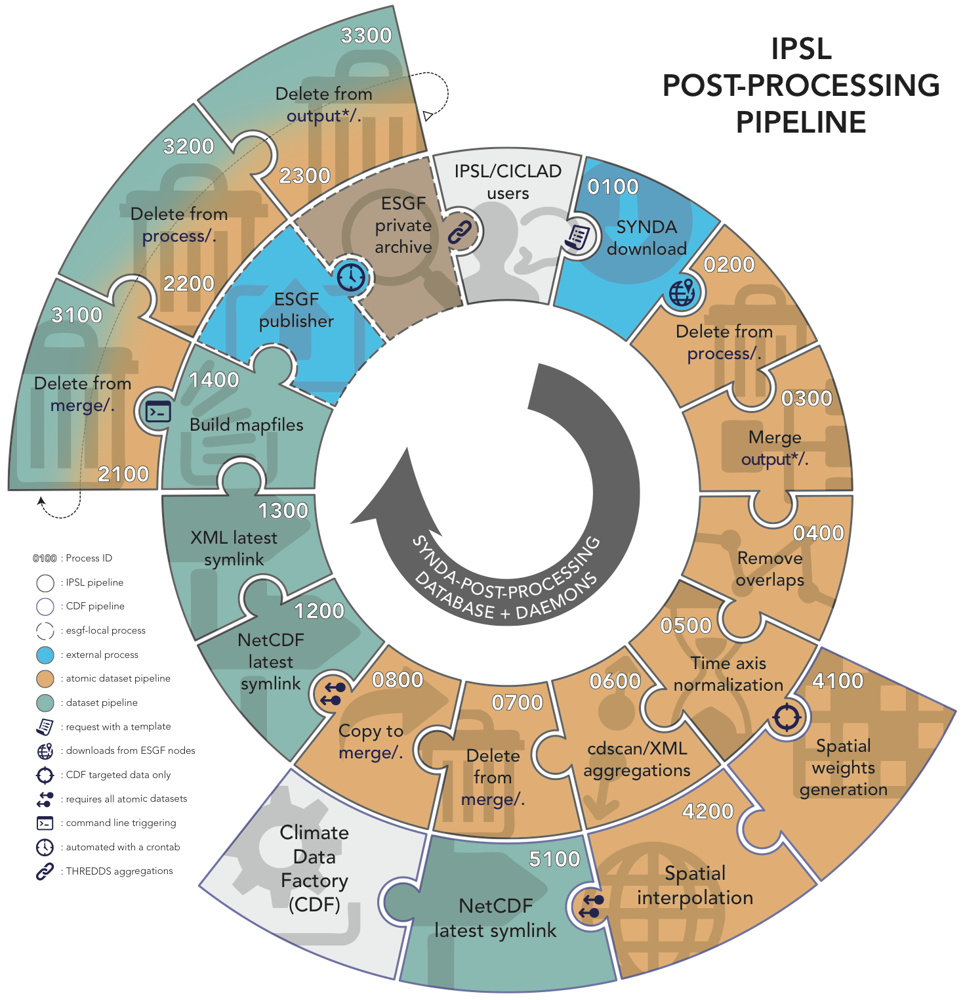

Analysis plateform
==================

The PRODIGUER working team provides a set of specialized tools design to streamline and to ease analysis of data coming from the ESG-F distributed digital repositories. These tools are available as stand-alone command-line. They are also part of a post-processing pipeline deployed on CICLAD cluster as follows.

Large size : [http://dods.ipsl.jussieu.fr/glipsl/SDPPP-schema.png](http://dods.ipsl.jussieu.fr/glipsl/SDPPP-schema.png)

Overview
--------

This pipeline is based on a SQLite database that allows a parallel, orderly and asynchronous post-processing on files stored in ``/prodigfs/esgf/mirror``. The workflow is divided into two related pipelines: the variable pipeline and the dataset one. A dataset version groups several variables. A dataset cannot be processed if all its variables do not reach the end of the variable pipeline without errors.

Each entry in the SQLite database describes and follows the post-processing progress of a variable or a dataset desribing an ID key, the transition (step) name, its state (``SXXXX``) and the status (``waiting``, ``running``, ``error`` or ``done``). 

A Python daemon (whom we call "worker") asks the database for waiting jobs regardless the step name through an RCP connexion. Each post-processing step is carried by a Python or Shell script. Accordingly to the job, the worker runs the corresponding script. Finally the worker updates the entry status in the database to reach the next transition.

A dataset is processed when all the corresponding variables reach the ``done`` status. No more jobs appears when all variables and datasets reach the ``done`` status.
